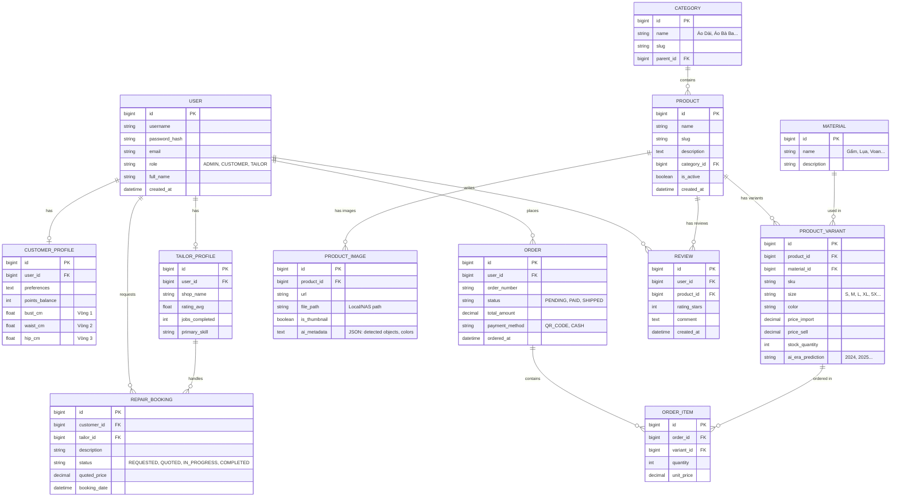

# Tài liệu Thiết Kế Cơ Sở Dữ Liệu (ERD) - Tuần 2

**Dự án:** Smart Fashion ERP
**Ngày tạo:** 28/01/2026
**Mục tiêu:** Thiết kế mô hình dữ liệu cho ứng dụng quản lý kho, bán hàng thời trang và dịch vụ sửa chữa, hỗ trợ tính năng Offline-first và AI phân tích.

## 1. Tổng Quan Mô Hình

Hệ thống được thiết kế xoay quanh các thực thể chính:

1. **Sản phẩm & Kho hàng (Product & Inventory):** Quản lý biến thể (Size, Màu), giá nhập/bán, và metadata từ AI.
2. **Khách hàng (Customer):** Hồ sơ số đo 3 vòng, lịch sử mua hàng, tích điểm.
3. **Đơn hàng (Order):** Xử lý giỏ hàng, thanh toán QR, và đồng bộ trạng thái kho.
4. **Dịch vụ Sửa chữa (Tailor Service):** Mạng lưới thợ may phi tập trung.

## 2. Diagram (Mermaid)

## 3. Chi Tiết Các Thực Thể Chính

### 3.1. User & Profiles

* **Users**: Bảng trung tâm quản lý xác thực.
* **CustomerProfile**: Lưu trữ số đo 3 vòng (Bust, Waist, Hip) để phục vụ thuật toán gợi ý size (Recommendation Engine).
* **TailorProfile**: Dành cho thợ sửa, chứa thông tin xếp hạng (Rating) và kỹ năng chuyên môn.

### 3.2. Product Catalog (Sản phẩm)

* **Product**: Thông tin chung của sản phẩm (Tên, Mô tả).
* **ProductVariant**: Nơi quản lý hàng tồn kho thực tế (Stock). Mỗi biến thể là một sự kết hợp của Size + Màu + Chất liệu.
  * *AI Features*: Trường `ai_era_prediction` lưu kết quả dự đoán niên đại từ module nhận diện hình ảnh.
  * *Pricing*: Tách biệt `price_import` (Giá nhập) và `price_sell` (Giá bán) để tính lợi nhuận.

### 3.3. Images & AI (Hình ảnh)

* **ProductImage**: Lưu đường dẫn file ảnh.
  * *Offline First*: Cần hỗ trợ lưu đường dẫn local (`file_path`) cho chế độ offline và URL (`url`) cho chế độ online.
  * *Metadata*: Trường `ai_metadata` (dạng JSON) lưu trữ kết quả phân tích thô từ AI (ví dụ: RGB codes, confidence score).

### 3.4. Orders (Đơn hàng)

* Hỗ trợ thanh toán QR Code.
* Trạng thái đơn hàng đồng bộ hóa kho (trừ `stock_quantity` trong `ProductVariant` khi đơn hàng `PAID`).

## 4. Ghi Chú Kỹ Thuật

1. **Naming Convention**: Sử dụng `snake_case` cho tên bảng và cột trong MySQL.
2. **Indexing**: Cần đánh index cho các cột tìm kiếm thường xuyên: `product_variant.sku`, `product.slug`, `user.email`.
3. **Offline Sync**: Các bảng `Order` và `Inventory` cần có cơ chế log thay đổi (Change Data Capture - CDC) để đồng bộ khi thiết bị kết nối lại internet.

---
*Tài liệu này được biên soạn dựa trên yêu cầu từ Tuần 1.*
