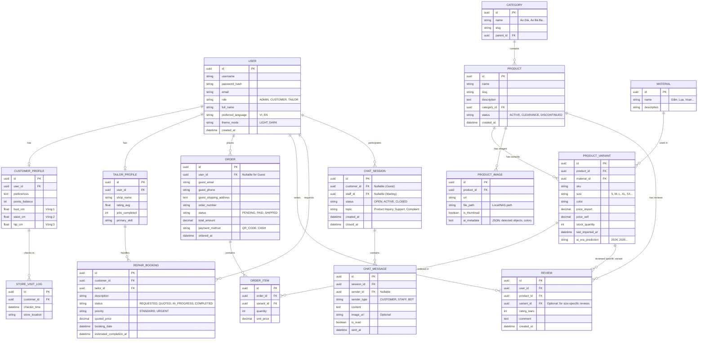

# Tài liệu Thiết Kế Cơ Sở Dữ Liệu (ERD) - Tuần 2

**Dự án:** Smart Fashion ERP
**Ngày tạo:** 28/01/2026
**Mục tiêu:** Thiết kế mô hình dữ liệu cho ứng dụng quản lý kho, bán hàng thời trang và dịch vụ sửa chữa, hỗ trợ tính năng Offline-first và AI phân tích.

## 1. Tổng Quan Mô Hình

Hệ thống được thiết kế xoay quanh các thực thể chính:

1. **Sản phẩm & Kho hàng (Product & Inventory):** Quản lý biến thể (Size, Màu), giá nhập/bán, và metadata từ AI.
2. **Khách hàng (Customer):** Hồ sơ số đo 3 vòng, lịch sử mua hàng, tích điểm.
3. **Đơn hàng (Order):** Xử lý giỏ hàng, thanh toán QR, và đồng bộ trạng thái kho.
4. **Dịch vụ Sửa chữa (Tailor Service):** Mạng lưới thợ may phi tập trung.

## 2. Diagram (Mermaid)

## 3. Chi Tiết Các Thực Thể Chính

### 3.1. User & Profiles
*   **Users**: Bảng trung tâm quản lý xác thực.
    *   *Settings*: Lưu `preferred_language` và `theme_mode` để cá nhân hóa trải nghiệm.
*   **CustomerProfile**: Lưu trữ số đo 3 vòng (Bust, Waist, Hip) để phục vụ thuật toán gợi ý size.
*   **StoreVisitLog**: Ghi nhận lịch sử check-in của khách hàng tại cửa hàng, hỗ trợ tính năng "Smart Welcome" (nhận diện khách cũ và gợi ý nhanh).

### 3.2. Product Catalog (Sản phẩm)
*   **Product**: Quản lý vòng đời sản phẩm thông qua trường `status`.
    *   `ACTIVE`: Đang kinh doanh.
    *   `CLEARANCE`: Xả hàng (thường đi kèm giảm giá).
    *   `DISCONTINUED`: Ngừng kinh doanh (không hiển thị cho khách, nhưng giữ data báo cáo).
*   **ProductVariant**: Quản lý kho chi tiết.
    *   `last_imported_at`: Theo dõi tuổi tồn kho. Nếu > 90 ngày sẽ cảnh báo để chuyển sang chế độ Xả hàng.

### 3.3. Orders (Đơn hàng)
*   **Guest Checkout**: Hỗ trợ khách vãng lai mua hàng không cần account.
    *   Nếu `user_id` là null, hệ thống sẽ sử dụng thông tin từ `guest_email`, `guest_phone`.
*   **Payments**: Hỗ trợ QR Code và tiền mặt.

### 3.4. Dịch vụ Sửa chữa (Tailor Service)
*   **Phân cấp độ ưu tiên**: Trường `priority` (URGENT/STANDARD) giúp thợ may sắp xếp công việc.
*   **Tiến độ**: Theo dõi trạng thái từ lúc Yêu cầu -> Báo giá -> Đang sửa -> Hoàn tất.

### 3.5. Live Chat & Support (CSKH)
*   **ChatSession**: Quản lý phiên hội thoại giữa Khách hàng (User/Guest) và Nhân viên (Staff).
    *   *Trạng thái*: `OPEN` (Chờ nhân viên), `ACTIVE` (Đang chat), `CLOSED` (Kết thúc).
*   **ChatMessage**: Lưu nội dung tin nhắn, hỗ trợ gửi ảnh (`image_url`) để khách hàng gửi mẫu áo cần tư vấn.
    *   *Real-time*: Thiết kế này hỗ trợ WebSocket để chat thời gian thực.

## 4. Ghi Chú Kỹ Thuật

1.  **UUID Primary Keys**: Toàn bộ hệ thống sử dụng **UUID** làm khóa chính thay vì BigInt tự tăng. Điều này bắt buộc để hỗ trợ tính năng **Offline-first**, giúp các thiết bị (iPad tại cửa hàng, điện thoại Admin) có thể sinh ID đơn hàng/sản phẩm ngay cả khi mất mạng mà không lo trùng lặp khi đồng bộ lại.
2.  **Naming Convention**: Sử dụng `snake_case` cho tên bảng và cột trong MySQL.
3.  **Indexing**: Index các cột tìm kiếm: SKU, Slug, Email, và `checkin_time` (để lọc khách mới đến).
4.  **Offline Sync**: Cần cơ chế Change Data Capture (CDC) hoặc tabl `SyncLog` để đồng bộ dữ liệu hai chiều (Client <-> Server).

---
*Tài liệu này được biên soạn dựa trên yêu cầu từ Tuần 1 và cập nhật tính năng Offline/Lifecycle vào Tuần 2.*
