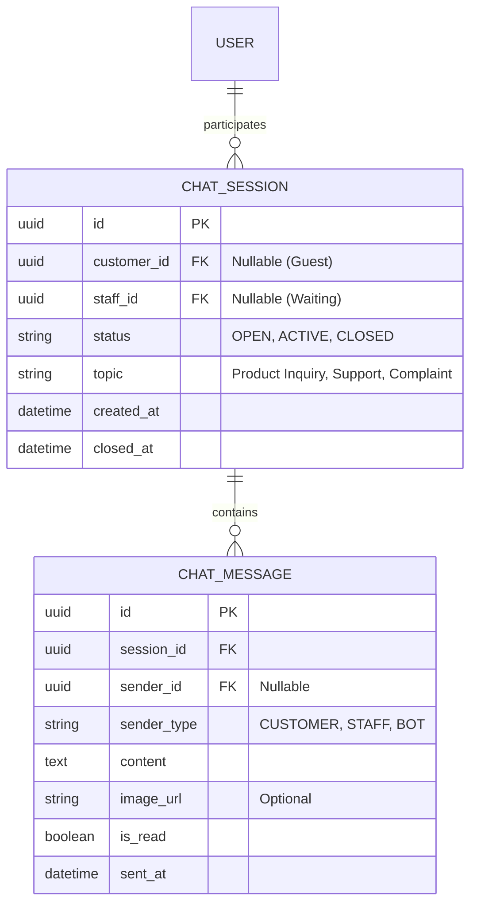

# Tài Liệu Cập Nhật Thiết Kế Hệ Thống - Tuần 3
**Dự án:** Smart Fashion ERP
**Ngày tạo:** 04/02/2026
**Mục tiêu:** Cập nhật thiết kế ERD để hỗ trợ Offline-first, mở rộng tính năng Chăm sóc khách hàng (Live Chat), và quản lý vòng đời sản phẩm chi tiết.

---

## 1. Tổng Quan Sự Thay Đổi
Trong Tuần 3, hệ thống sẽ trải qua đợt nâng cấp lớn về cấu trúc dữ liệu và bổ sung module nghiệp vụ mới:

1.  **Chuyển đổi Core Database:** Thay đổi toàn bộ khóa chính sang **UUID** (Offline-first).
2.  **Cập nhật Nghiệp vụ Bán hàng:** Hỗ trợ khách vãng lai (Guest), Check-in thông minh (Store Visit), và Quản lý vòng đời sản phẩm.
3.  **Module Mới:** Hệ thống Chat trực tuyến & Chăm sóc khách hàng (CSKH).

---

## 2. Chi Tiết Thay Đổi ERD & Database

### 2.1. Chuyển đổi Khóa chính (Primary Key Strategy)
*   **Thay đổi:** Chuyển từ `BigInt` (Auto Increment) sang `UUID`.
*   **Lý do:**
    *   **Offline-first:** Cho phép các thiết bị (iPad ở cửa hàng, điện thoại Admin) tự sinh ID cho đơn hàng/sản phẩm khi mất mạng mà không lo trùng lặp khi đồng bộ lại (Sync) với Server.
    *   **Bảo mật:** UUID khó đoán hơn số thứ tự tăng dần.

### 2.2. Các Thực Thể Được Cập Nhật (Updated Entities)

#### A. Bảng `USER` (Người dùng) - *Cá nhân hóa*
*   **Thêm:** `preferred_language` (VI/EN).
*   **Thêm:** `theme_mode` (LIGHT/DARK).
*   **Mục đích:** Lưu cài đặt giao diện riêng cho từng Admin và Khách hàng.

#### B. Bảng `PRODUCT` & `PRODUCT_VARIANT` (Sản phẩm) - *Lifeycle*
*   **Thêm (Product):** `status` (Enum: `ACTIVE`, `CLEARANCE` - Xả hàng, `DISCONTINUED` - Ngừng bán).
*   **Thêm (Variant):** `last_imported_at` (Datetime).
*   **Mục đích:** Hệ thống tự động cảnh báo tồn kho > 90 ngày (dựa vào `last_imported_at`) để đề xuất chuyển trạng thái sang `CLEARANCE`.

#### C. Bảng `ORDER` (Đơn hàng) - *Guest Checkout*
*   **Thay đổi Constraint:** Trường `user_id` trở thành `nullable` (có thể null).
*   **Thêm:** `guest_email`, `guest_phone`, `guest_shipping_address`.
*   **Mục đích:** Cho phép khách vãng lai mua hàng không cần đăng ký, nhưng vẫn lưu lại Email/SĐT để Remarketing sau này.

#### D. Bảng `REPAIR_BOOKING` (Dịch vụ Sửa chữa)
*   **Thêm:** `priority` (URGENT/STANDARD).
*   **Thêm:** `estimated_completion_at` (Datetime).
*   **Mục đích:** Thợ may (Tailor) biết ưu tiên đơn gấp và khách hàng biết chính xác ngày giờ nhận đồ.

### 2.3. Các Thực Thể Mới (New Entities)

#### E. Bảng `STORE_VISIT_LOG` (Nhật ký ghé thăm)
*   **Mục đích:** Phục vụ tính năng "Smart Check-in" tại cửa hàng.
*   **Cấu trúc:**
    *   `id` (UUID, PK)
    *   `customer_id` (UUID, FK)
    *   `checkin_time` (Datetime)
    *   `store_location` (String)

---

## 3. Module Mới: Live Chat & CSKH (Chat Feature)

Đây là chức năng trọng tâm mới của Tuần 3, giúp kết nối trực tiếp Khách hàng và Nhân viên tư vấn.

### 3.1. Mô tả Chức năng
1.  **Real-time Chat:** Khách hàng nhắn tin trực tiếp trên Website/App.
2.  **Context-aware:** Khi khách nhắn từ trang sản phẩm "Áo dài A", nhân viên biết ngay ngữ cảnh để tư vấn size.
3.  **Lịch sử & Đánh giá:** Lưu đoạn chat để admin kiểm tra chất lượng phục vụ.

### 3.2. Thiết Kế ERD cho Module Chat

### 3.3. Luồng Nghiệp Vụ (Workflow)
1.  **Khởi tạo:** Khách bấm nút "Chat ngay" -> Hệ thống tạo `CHAT_SESSION` (Status: `OPEN`).
2.  **Phân phối:** Tin nhắn gửi đến hàng đợi của Nhân viên CSKH.
3.  **Kết nối:** Nhân viên nhận chat -> Update Session (Status: `ACTIVE`, `staff_id` = Nhân viên A).
4.  **Tương tác:** Hai bên gửi tin nhắn (`CHAT_MESSAGE`) qua WebSocket.
5.  **Kết thúc:** Một trong hai bên bấm "Kết thúc" -> Session đóng (Status: `CLOSED`), hệ thống hiển thị form đánh giá sao.

---

## 4. Tổng Kết Cấu Trúc Hệ Thống (Tuần 3)

Hệ thống sau cập nhật Tuần 3 sẽ bao gồm các nhóm thực thể chính:
1.  **Identity:** User, Roles, Profiles + *Settings*.
2.  **Ecommerce Core:** Category, Product, Variant (Inventory), Images + *Product Lifecycle*.
3.  **Sales:** Order (Guest/User), OrderItem, Payment.
4.  **Services:** Repair Booking + *Priority*.
5.  **Engagement (Mới):** Reviews, *Store Visit Log*, *Chat System*.

Tài liệu này dùng làm căn cứ để đội ngũ Dev triển khai code Backend (Entity Java) và Frontend (UI Chat) trong giai đoạn tiếp theo.
